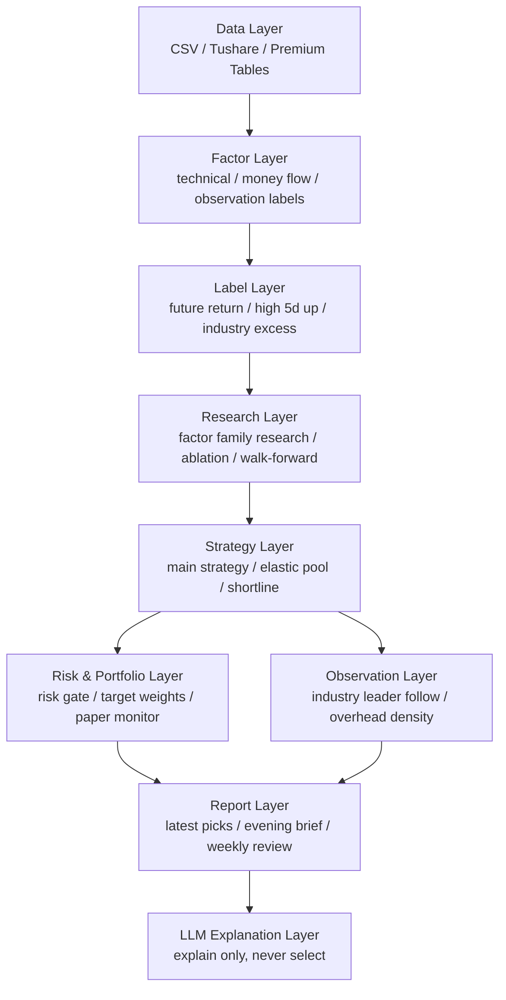

# A Share Quant Codex

一个面向 A 股日 K 的量化研究、候选池监控与 LLM 日报解释框架。


> 本项目不是荐股服务，也不是实盘交易建议。它提供的是一套可复现、可审计、可扩展的量化研究工程骨架：用数据验证投资假设，用规则生成候选池，用审计避免未来函数，用报告解释量化结果。

## 项目定位

传统投资常说“公司不错”“行业有前景”“市场要反弹”。这个项目做的是把这些判断拆成可验证的工程流程：

1. 提出投资假设
2. 用历史数据验证
3. 把有效逻辑沉淀成规则、因子或观察标签
4. 在连续样本外周期里观察是否仍然有效

项目核心目标不是堆因子，而是提升候选池质量：

- 主策略 `top20 / top10 / top5` 是否更稳定
- 高分票是否更容易兑现收益
- 回撤和无效换手是否可控
- 新因子、新标签、新规则是否有明确升级纪律
- LLM 是否只负责解释，不参与选股决策

## 功能特性

- A 股日 K 数据统一 schema，支持本地 CSV 与 Tushare 增量更新。
- 技术因子、资金流、低频基本面观察因子、观察层标签。
- 时间有序切分、walk-forward、TimeSeriesSplit 风格研究流程。
- 因子家族研究：IC、IR、分箱收益、缺失率、相关性、研究结论状态。
- 主策略、弹性池、精选短线机会三条候选池输出链路。
- 候选池质量看板：滚动收益、命中率、回撤、胜率、盈亏比。
- 观察层标签：龙头扩散、上方兑现压力，用于日报解释和复盘。
- 轻量向量化策略 sandbox，用于快速验证规则原型。
- 策略审计层：检查未来函数、信号与持仓对齐、成本模型、缺失交易日。
- ML 研究线：XGBoost / LightGBM 概率分数作为观察分或候选重排分。
- LLM 日报解释层：读取结构化 JSON，生成大盘、策略、个股和风险解释。
- PushPlus 推送脚本，支持晨报、晚报、周报。

## 系统分层



## 三层策略纪律

| 层级 | 职责 | 默认行为 |
| --- | --- | --- |
| 主分层 | 决定哪些股票排到前面 | 只放已证明有系统级增量的核心因子 |
| 观察层 | 解释候选池为什么强、隐患在哪里 | 不改排序，不改执行，只服务阅读和复盘 |
| 执行管理层 | 决定买入、持有、止损、减仓等动作 | 当前默认冻结，只有跨时间稳定且动作含义清楚才允许升级 |

当前观察层内置：

- `industry_leader_follow_*`：龙头扩散标签，解释强势是否从个体扩散到板块。
- `overhead_density_*`：上方兑现压力标签，解释冲高后是否容易遇到抛压。

## 快速开始

### 1. 克隆项目

```bash
git clone https://github.com/thuwindy/a-share-quant-codex.git
cd a-share-quant-codex
```

### 2. 安装依赖

```bash
python3 -m venv .venv
.venv/bin/python -m pip install -r requirements.txt
```

### 3. 运行模拟数据 demo

```bash
.venv/bin/python examples/generate_mock_data.py
.venv/bin/python examples/run_mock_backtest.py
```

输出会写入：

```text
outputs/mock_metrics.json
outputs/equity_curve.csv
outputs/equity_curve.png
outputs/factor_weights.json
outputs/target_weights.csv
```

### 4. 运行测试

```bash
.venv/bin/python -m unittest discover -s tests
```

## 使用真实 A 股日 K 数据

本开源仓库不包含真实行情数据。你可以使用自己的 CSV 数据，或配置 Tushare token 后增量更新。

### 方式 A：把本地逐股票 CSV 标准化

```bash
.venv/bin/python scripts/bootstrap_cn_history_directory.py \
  --source-dir /path/to/your/cn_daily_csv_dir \
  --output-path data/a_share_daily.csv
```

### 方式 B：使用 Tushare 增量更新

复制环境变量模板：

```bash
cp .env.example .env
```

在本地 shell 或 `.env` 中配置：

```text
TUSHARE_TOKEN=your_tushare_token
TUSHARE_BYPASS_SYSTEM_PROXY=1
```

先做连通性检查：

```bash
.venv/bin/python scripts/check_tushare_connection.py --bypass-system-proxy
```

再执行增量更新：

```bash
.venv/bin/python scripts/update_tushare_daily_dataset.py \
  --existing-path data/a_share_daily.csv \
  --bypass-system-proxy
```

## 常用命令

### 生成最新候选池

```bash
.venv/bin/python scripts/generate_latest_picks.py \
  --data-path data/a_share_daily.csv \
  --adjust qfq \
  --output-prefix latest_picks
```

### 跑真实日 K 研究回测

```bash
.venv/bin/python examples/run_real_daily_backtest.py \
  --data-path data/a_share_daily.csv \
  --adjust qfq \
  --research-config configs/recommended_default_config.json \
  --backtest-config configs/backtest_liquidity.json
```

### 跑 walk-forward 稳定性验证

```bash
.venv/bin/python scripts/run_walk_forward_grid.py \
  --input-path data/a_share_daily.csv \
  --start-date 2019-01-01 \
  --max-codes-list 200,500 \
  --train-years-list 2,3 \
  --adjust qfq \
  --output-prefix walk_forward_expanded
```

### 跑因子家族研究

```bash
.venv/bin/python analysis/run_factor_family_research.py \
  --data-path data/a_share_daily.csv \
  --config configs/research_factor_family_momentum.json \
  --output-dir outputs/factor_family_momentum
```

典型输出包括：

- 单因子 IC 均值
- IC 标准差
- IR
- 分箱收益表
- 分箱单调性检查
- 年度分段 IC
- 缺失率
- 与现有主因子的相关性
- `research_status`: `keep / observe / reject`
- `role_assignment`: `production_core_factor / research_factor / observation_label / execution_rule_candidate / archived_reject`

### 跑候选池质量看板

```bash
.venv/bin/python scripts/run_stable_observation_daily_check.py \
  --data-path data/a_share_daily.csv \
  --research-config configs/research_production_default.json \
  --output-prefix candidate_pool_quality_dashboard
```

看板重点回答：

- 主策略 `top20 / top10 / top5` 质量是否稳定
- 滚动收益、命中率、回撤、胜率、盈亏比是否恶化
- 观察层标签是否真的帮助解释候选池
- 失败归因更像排序问题，还是兑现路径问题

### 跑向量化策略 sandbox

```bash
.venv/bin/python analysis/vectorized_strategy_sandbox.py \
  --data-path data/a_share_daily.csv \
  --strategy breakout \
  --output-dir outputs/vectorized_sandbox
```

sandbox 不是生产回测替代品，它用于快速验证规则原型并生成审计报告：

- 是否使用 `shift(1)` 做 T+1 执行
- 是否存在同日收盘信号同日成交
- 收益口径是否清楚
- 手续费和滑点是否计入
- 信号、持仓、收益是否对齐

## LLM 日报解释层

LLM 在本项目中只做解释层，不做选股决策层。

LLM 必须基于结构化 JSON 中已经存在的量化结果进行分析：

- 主策略分数、排名、价格、行业、观察标签、`ml_score`
- 弹性池分数、价格、市值、流动性
- 短线分、连板、封单、换手、风险等级、买点区间、止损
- 风控状态、市场宽度、板块轮动
- Tushare 基本面字段，例如估值、ROE、营收和利润增速、负债率、毛利率

配置方式：

```bash
cp .env.example .env
```

`.env.example` 中包含：

```text
LLM_API_KEY=
LLM_BASE_URL=https://api.deepseek.com/v1
LLM_MODEL=deepseek-chat
PUSHPLUS_TOKEN=
PUSHPLUS_TOPIC=
PUSHPLUS_CHANNEL=wechat
```

运行 LLM 旁路报告：

```bash
.venv/bin/python scripts/llm_report_renderer.py
```

发送 LLM 增强晚报：

```bash
.venv/bin/python scripts/send_pushplus_llm_evening_brief.py \
  --llm-timeout-seconds 120 \
  --llm-max-tokens 1200
```

硬校验规则：

- 禁止 LLM 输出不在 JSON 里的股票名。
- 禁止 LLM 自己编价格、涨幅、财务数字。
- 缺少量化字段时必须写“暂不可判定”。
- 某个 agent 失败时只降级该板块，不影响整份日报。
- 主库不是最新可用交易日时，晚报应拒绝推送旧数据。

## 目录结构

```text
.
├── analysis/                  # 研究脚本、因子家族研究、策略 sandbox
├── codex_skills/              # Codex 本地技能说明
├── configs/                   # 研究、回测、风控、日报配置
├── data/                      # 本地数据目录，开源仓库仅保留 .gitkeep
├── docs/                      # 架构、研究流程、稳定观察期、LLM 旁路说明
├── examples/                  # mock 数据、真实数据回测、paper execution demo
├── outputs/                   # 运行输出目录，开源仓库仅保留 .gitkeep
├── scripts/                   # 数据更新、日报、监控、训练、回测工作流脚本
├── src/ashare_quant/          # 核心 Python 包
│   ├── analysis/              # 候选池质量、绩效、walk-forward、报告
│   ├── backtest/              # 研究型回测引擎、成本、指标
│   ├── execution/             # paper monitor 与交易接口骨架
│   ├── factors/               # 技术因子、注册表、中性化
│   ├── labels/                # 未来收益与分类标签
│   ├── models/                # 线性、Boosting、ML ranker
│   ├── portfolio/             # 组合构建
│   └── service/               # dashboard / trade API 骨架
├── tests/                     # 单元测试
├── .env.example               # 环境变量模板，不包含真实密钥
├── SECURITY.md                # 开源安全说明
└── README.md
```

## 数据格式

核心日 K 表至少需要以下列：

```text
date, code, open, high, low, close, volume, amount
```

可选增强列：

```text
name, industry, market_cap, float_market_cap,
pe_ttm, pb, ps_ttm, roe, gross_margin, debt_to_assets
```

低频基本面因子默认只作为研究和观察字段，不直接进入生产主分。原因是财报数据必须按可见时点处理，不能把未来公告后的财务数据错误地当作历史当日可见。

## 配置说明

常用配置：

| 文件 | 用途 |
| --- | --- |
| `configs/research_production_default.json` | 当前主策略研究配置 |
| `configs/research_under20_elastic_top20.json` | 20 元以下弹性池配置 |
| `configs/research_shortline_opportunity.json` | 精选短线机会配置 |
| `configs/risk_governor.json` | 风控门配置 |
| `configs/recommended_default_config.json` | 默认推荐研究配置 |
| `configs/research_factor_family_*.json` | 因子家族研究配置 |
| `configs/research_ml_*.json` | ML 研究配置 |

## 开源安全

这个仓库不包含：

- 真实 Tushare token
- LLM API key
- PushPlus token
- 个人路径
- 云服务器 IP
- SSH 私钥
- 真实行情主库
- 运行产物和日志

真实密钥请放在本地环境变量或未跟踪的 `.env` 文件中。参考 `SECURITY.md`。

## 当前边界

- 这是研究型工程框架，不是自动实盘交易系统。
- 回测是日 K 研究回测，不是逐笔撮合。
- A 股涨跌停、停牌、T+1、滑点、冲击成本都需要在正式交易前做更严格建模。
- LLM 输出只能解释量化结果，不能替代量化决策。
- 开源仓库不附带真实数据，用户需要自行准备合法数据源。

## 推荐阅读顺序

1. `docs/architecture.md`
2. `docs/17_research_audit_workflow.md`
3. `docs/18_stable_observation_cycle.md`
4. `docs/19_llm_sidecar_ops_and_report.md`
5. `AGENTS.md`

## License

MIT License. See `LICENSE`.

