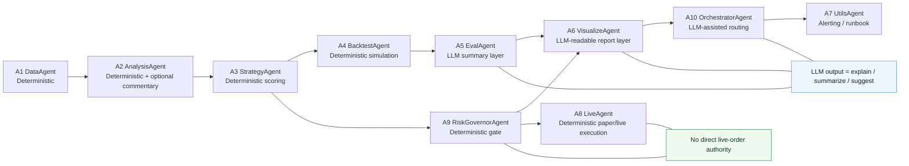

# LLM Agent Integration Plan

This document defines where large-model assistance should and should not be introduced across the 10-agent quant workflow.

## Design Principle

- Keep data, backtest, risk, and live execution deterministic.
- Use LLMs for explanation, summarization, anomaly triage, and optional veto suggestions.
- Never let an LLM directly bypass hard risk rules or place live orders.

## Recommended LLM Attachment Points

| Agent | Recommended | Role |
| --- | --- | --- |
| A1 DataAgent | No | deterministic fetch/clean only |
| A2 AnalysisAgent | Optional | feature-quality commentary only |
| A3 StrategyAgent | Limited | macro/industry veto suggestions, not direct weight setting |
| A4 BacktestAgent | No | deterministic simulation only |
| A5 EvalAgent | Yes | explain ablation deltas, summarize improvement/decay |
| A6 VisualizeAgent | Yes | generate readable daily brief, analyst/trader dual view |
| A7 UtilsAgent | Optional | failure-log triage and runbook suggestion |
| A8 LiveAgent | No | live execution must remain rule-based |
| A9 RiskGovernorAgent | No | final gate must remain deterministic |
| A10 OrchestratorAgent | Yes | route retries/degrade/report decisions with hard guardrails |

## Guardrail Policy

### Hard deterministic boundary

- A1/A4/A8/A9 outputs are authoritative.
- LLM outputs can annotate these outputs but cannot override them.
- Any live-trade gate remains controlled by config + code only.

### Suggested LLM boundary

- A5 can transform metrics into explanations:
  - what changed
  - why performance improved/decayed
  - whether the result looks monitor-only or tradable
- A6 can transform metrics + picks + risk into:
  - readable dashboard text
  - analyst view
  - trader view
  - exception summary
- A10 can consume failure events and propose:
  - retry
  - degrade premium sync
  - skip non-critical branch
  - notify human

## Reference Architecture

## Minimal Rollout Order

1. Attach LLM to A6 VisualizeAgent for readable daily brief only.
2. Attach LLM to A5 EvalAgent for experiment/post-mortem summaries.
3. Attach LLM to A10 OrchestratorAgent for failure triage suggestions.
4. Optionally attach a weak-veto helper to A3 StrategyAgent, but keep veto non-binding until validated.

## Not Recommended Yet

- LLM-generated direct buy/sell weights
- LLM-controlled live order placement
- LLM overriding risk governor `BLOCK`
- LLM filling missing data or guessing unavailable premium fields

## Practical Next Step

- Phase 1: use LLM only to generate `daily_brief.md` and `experiment_commentary.md`
- Phase 2: let A10 classify failures into `retry / degrade / notify`
- Phase 3: test A3 macro-veto suggestions in paper mode only
